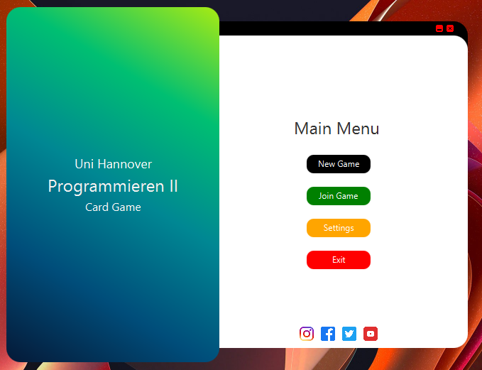
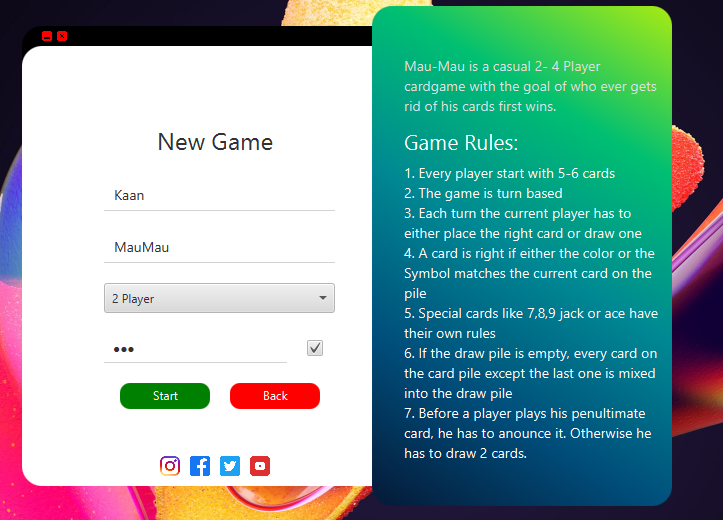
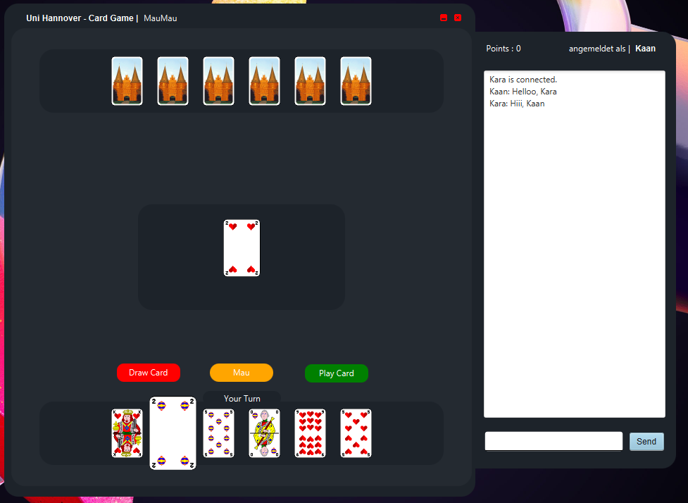

# MauMau Card Game (2021 Archive) 🃏🌐

> **"A preserved relic from my early B.Sc. Computer Science days. Exactly as it was submitted for the final grade."**

## 🌟 Overview
This is a digital time capsule of my **first-ever software project**. It was developed in **2021** as a final assignment for the **"Programmieren II"** course at **Leibniz Universität Hannover (LUH)**.

## 📸 Screenshots
Here is a look at the original UI design from 2021:

| Main Menu | New Game Setup | In-Game UI |
| :---: | :---: | :---: |
|  |  |  |

## 👥 The Team
This project was a collaborative effort by:
* **Justus Finke**
* **Daniel Tverdunov**
* **Kaan Kara**

## 🛠️ Technical Highlights
* **LAN Multiplayer:** Implemented using **Java Sockets**. Players on the same network can join a shared session.
* **JavaFX GUI:** Built with JavaFX to provide a graphical user interface (at a time when we were just learning Event Handling and Threads).

## 🕰️ The "6+6 Challenge" (Pre-AI Era)
* **The Timeline:** We had 6 weeks to learn Java basics, followed by only **6 weeks** to design and build this entire networked application.
* **No AI Assistance:** Built in the pre-ChatGPT era. Every logic puzzle, socket connection, and UI layout was resolved using university lectures and intense **Stack Overflow** research.

## 🚀 How to Run the Game
Since this app uses **JavaFX**, you need the appropriate runtime components to run the `.jar` file.

### Option A: The Easiest Way
Install a JDK that includes JavaFX, such as **Azul Zulu (JDK FX)** or **Bellsoft Liberica (Full JDK)**. Then simply run:
```bash
java -jar Cardgame.jar
